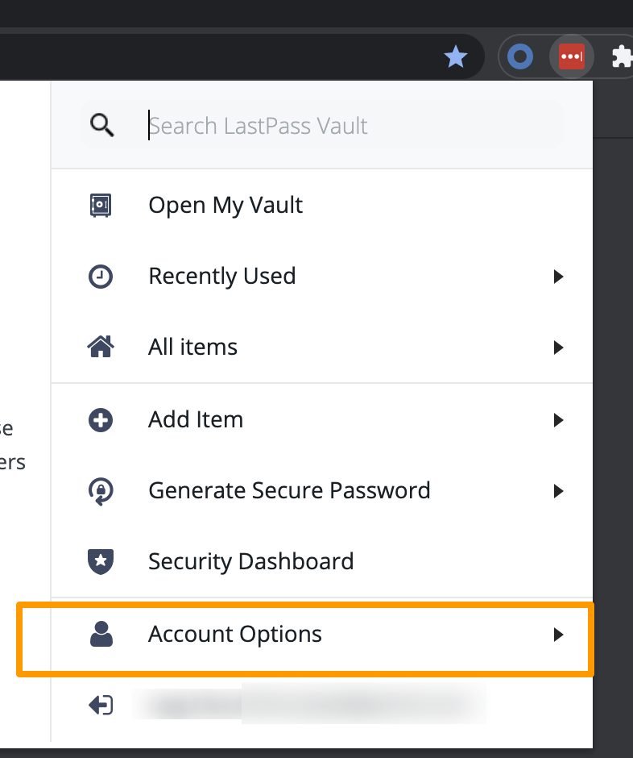

# Last2KDBX
> Convert LastPass CSV to [KDBX 4](https://keepass.info/help/kb/kdbx_4.html) (KeePass Database Format)

## Get Start
1. Export LastPass CSV file
   1. Install [LastPass Browsers Extension](https://chrome.google.com/webstore/detail/lastpass-free-password-ma/hdokiejnpimakedhajhdlcegeplioahd)
   2. Login LastPass with the extension
   3. Export CSV file via the extension menu: `Account Options` -> `Advanced` -> `Export` -> `LastPass CSV File`

      

2. Convert to KDBX 4
   1. Open [Last2KDBX](https://last2kdbx.yelo.ooo/)
   2. Click the `Load file` button and select the CSV file
   3. A KDBX 4 file will be downloaded automatically.

      

## FAQ
1. What's the password of KDBX file?
   
      Nothing. Just keep it empty, and you can change it with other clients. e.g.: [KeeWeb](https://keeweb.info/)

2. Is that safe to sending my csv to your site?

      Absolutely! The transformation is totally local. Nothing will be sent to the servers.

## License
MIT &copy; [yelo](https://github.com/imyelo), 2021 - present
